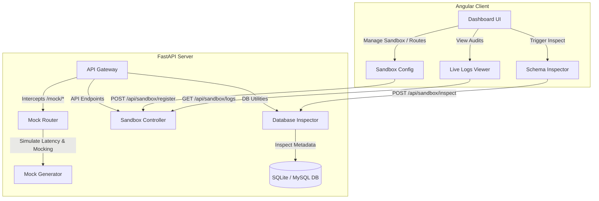

# QueryLab Mock Engine

A local high-performance mock simulation daemon featuring dynamic database inspection and smart mock data generation. QueryLab Mock Engine allows developers to register custom mock routes, simulate network latency, inspect SQLite/MySQL databases on-the-fly, and generate realistic database-schema-aligned payloads for testing frontends and microservices.

---

## Architecture Overview

The application is structured into two main components:
1. **Backend**: Built with **FastAPI** (Python 3) and **SQLAlchemy** to perform dynamic schema inspection and intercept wildcard proxy calls under `/mock/*`.
2. **Frontend**: A modern dashboard built using **Angular 17** that allows users to register sandboxes, configure routing rules, check request auditing logs, and trigger database inspections.



---

## Features

- 🔍 **Dynamic Database Schema Inspection**: Instantly read column structures, constraints, and data types from any valid SQLite or MySQL connection string using SQLAlchemy reflection.
- 🧠 **Smart Mock Data Generation**: Generates context-aware, realistic mock data matching column names and data types (e.g., matching `"email"` with dummy emails, `"price"` with floats, `"status"` with states, and primary keys with auto-incrementing integers).
- ⚡ **Wildcard Endpoint Mocking**: Supports GET, POST, PUT, and DELETE operations routed via `/mock/{proxy_path}` which dynamically serve list or detail mock payloads.
- ⏱️ **Network Latency Simulation**: Configure individual route latency (in milliseconds) to simulate slow networks or server processing times.
- 🪵 **Trace Auditing Logs**: A live audit trail logs intercepted request methods, latency, status codes, and payload sizes.

---

## Project Structure

```text
QueryLab Mock Engine/
├── backend/
│   ├── main.py                 # FastAPI application and route interceptor
│   ├── database_inspector.py   # DB schema reflection and synthetic data generation
│   ├── schemas.py              # Pydantic data models for configuration
│   ├── create_test_db.py       # Helper script to populate test SQLite DB
│   └── requirements.txt        # Python backend dependencies
├── frontend/
│   ├── src/                    # Angular application source
│   ├── angular.json            # Angular CLI configuration
│   └── package.json            # Node.js dependencies and run scripts
├── pyrightconfig.json          # Python language server configurations
└── README.md                   # Project documentation
```

---

## Getting Started

### 1. Running the Backend (FastAPI)

#### Prerequisites
- Python 3.10+
- Pip package manager

#### Setup and Run
1. Navigate to the project root directory:
   ```bash
   cd "QueryLab Mock Engine"
   ```
2. Install the python dependencies:
   ```bash
   python -m pip install -r backend/requirements.txt
   ```
3. (Optional) Initialize the local SQLite test database:
   ```bash
   python backend/create_test_db.py
   ```
4. Start the FastAPI development server:
   ```bash
   python -m uvicorn backend.main:app --reload
   ```

The backend server will run on **[http://localhost:8000](http://localhost:8000)**. You can view the interactive Swagger API documentation at **[http://localhost:8000/docs](http://localhost:8000/docs)**.

---

### 2. Running the Frontend (Angular)

#### Prerequisites
- Node.js (v18+)
- npm package manager

#### Setup and Run
1. Open a new terminal window and navigate to the `frontend` folder:
   ```bash
   cd frontend
   ```
2. Install the web dependencies:
   ```bash
   npm install
   ```
3. Run the development server:
   ```bash
   npm start
   ```

The frontend application will be hosted on **[http://localhost:4200](http://localhost:4200)**. Open your browser and navigate there to access the dashboard.
